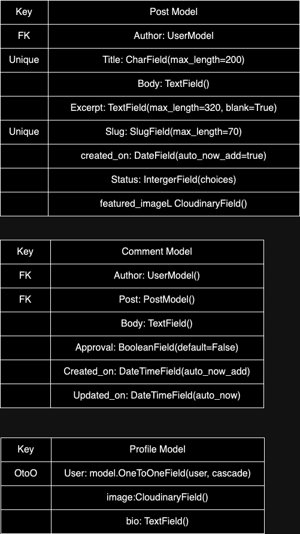
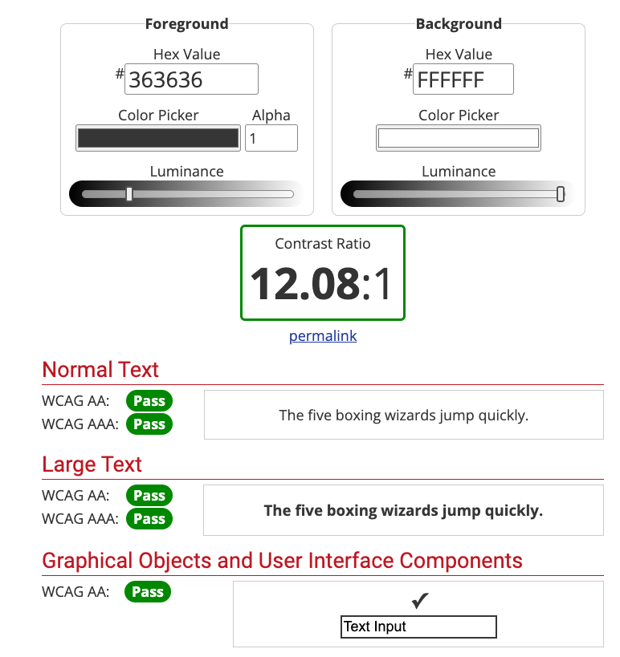
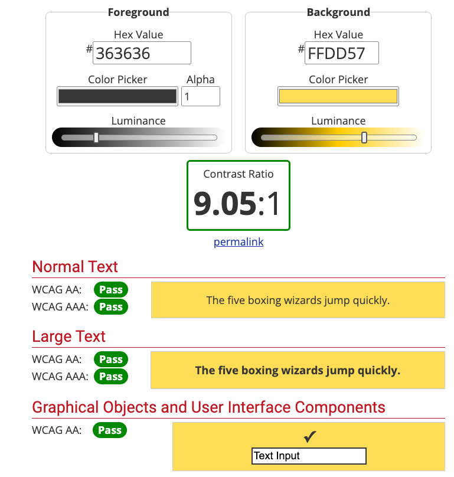
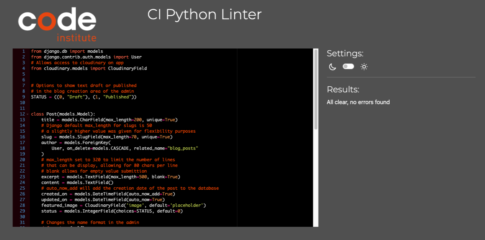
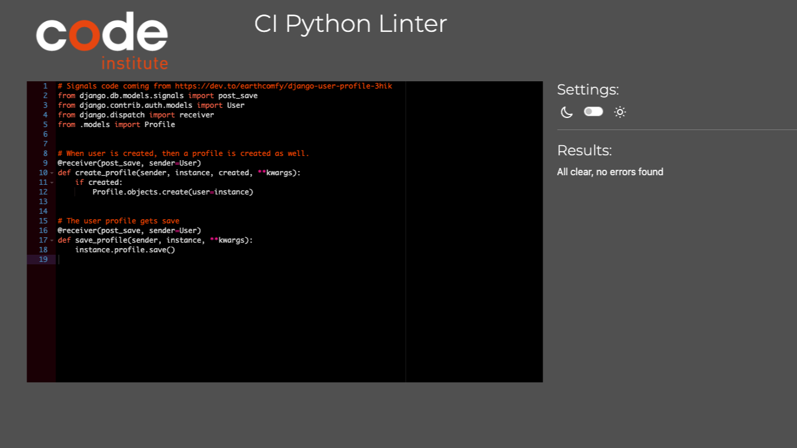
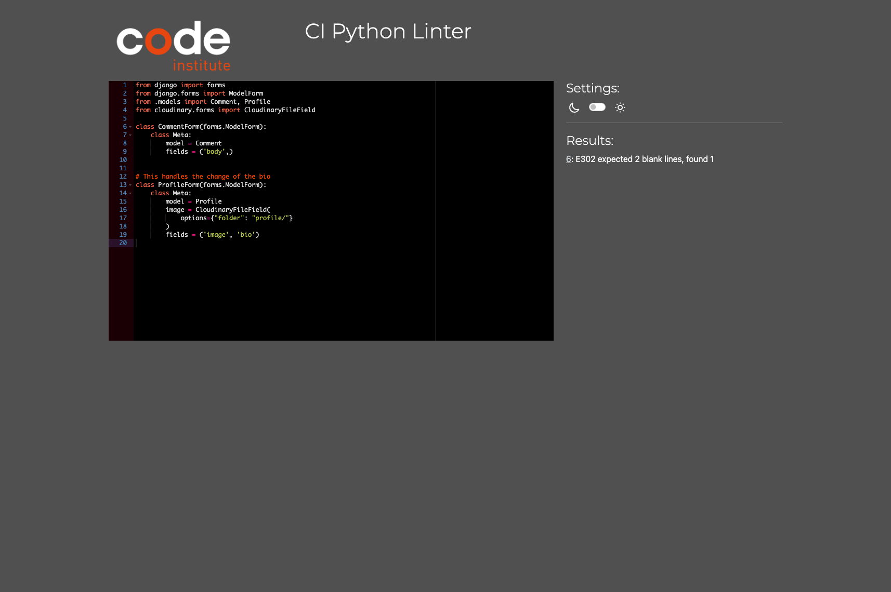
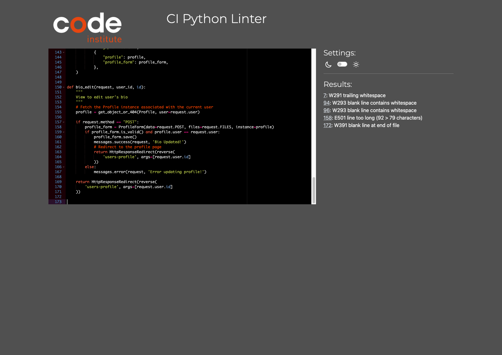
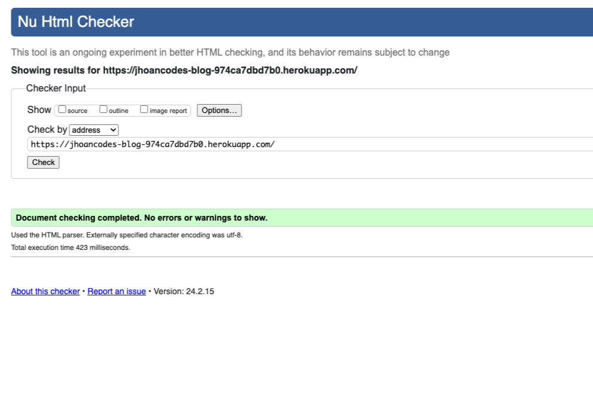

# Jhoan Codes - The Blog

A blog where I share insights, my personal experience, and tips about web development. The blog is a safe space for others to share comments, see post, interact with a community throught our post. 

> Blog built using Django, Javascript, CSS, and HTML. 

Deployed in **Heroku**: [Link to APP](https://jhoancodes-blog-974ca7dbd7b0.herokuapp.com/) 

## Table of Content

1. **UX/UI Design**
	- [UX](#ux)
	- [UI](#ux)
1. [Database Models](#database-design)
1. Technologies & Deployment
	- [Technologies Used](#technologies-used)
	- [Deployment](#deployment)
1. [Testing](#testing)
	- [Color](#color)
	- [Python CI Linter](#python-ci-linter)
	- [W3 HTML Validator test](#w3-html-validator-test)
	- [Manual testing](#manual-testing)
1. [Acknowledgements](#acknowledgements)

## UX/UI Design
In this section, we cover the initial project design ideas, the user experience/design, UI choices, wireframing, and the user stories.

### UX
#### Initial Ideal
The decision to create a blog stemmed from my desire to establish a space where I can share my knowledge, experiences, and journey in the world of web development with others. Additionally, since the Django framework is designed specifically for blog/news creation, I felt it would be fitting to test its capabilities by focusing on its specialized use case.

#### User Stories 
All user stories & epics can be find in the [Project board](https://github.com/users/jhoanTrujillo/projects/4)

#### Feature List
There were many features I wanted to implement in the blog. However, due to time constraints, I decided to prioritize the main features essential for a functioning blog. To allow room for future features and to adhere to a proper agile process, I included all desired features in the list, although not all were ultimately implemented. This was due to time constraints sadly.

To see the list of features and their current state, please see the [Project board](https://github.com/users/jhoanTrujillo/projects/4).

### UI
#### Wireframe & Framework
THe wireframe was easy. Since it is a personal project, I was able to just go with my own sense of style and aesthetic, also, bulma makes styling so easy, that designing for desktop was a great alternative, as the framework is design with mobile in mind by default, so all the elements/styling choices, default to a nice mobile viewport display. 

- [Here is the pdf file showing the overall experience - it was done via canvas](repo/media/logo.pdf)

#### Fonts
**Roboto/Bold**: The font is simple, clear, and easy to read. Additionally, the roundest of the font make it somehow approachable or friendly. This should create a welcoming/inviting experience.
**DM Sans/Regular**: I decided to this font in combination with Roboto to create a good contrast. DM Sans is also a highly readable font, but the difference in weight should provide a good contrast to ensure a proper visual hierarchy.

#### Color Scheme 
I wanted a light and energetic color palette that would compliment the selection of fonts.

- hsl(48, 100%, 67%)/#ffdd57 **Yellow** inspired by the [Bulma CSS palette](https://bulma.io/documentation/helpers/color-helpers/)  since the color is well balanced with white and black to create good contrast. It also helps highlight important elements in the site, such as titles, and divide certain page elements. 
- hsl(0, 100%, 100%)/#ffffff **White** is a color I consider to be classic web styling. Also, it is easy to contrast when using fonts that use shades of black and dark grey. 
- hsl(0, 0%, 21%)/#363636 **Dark gray** this shade of black/grey was selected as it softens the impact of the color black on the eyes, when in contrast with colors such as white and yellow.


[Back to top](#jhoan-codes---the-blog)
---

## Database Design
Although there are several models created for the project, some of them are handled by apps and Django packages. For example, superuser/admin access is managed by Django backend functionality, while visitor/user access and registration are handled by AllAuth. Therefore, the databases used for these specific cases won't be added to the section below.

Regarding the database, we have some basic models such as Post and Comments, which complement each other and communicate via a Foreign Key relationship, or Many-to-One. Since several comments are associated with one post, and several posts can be connected to a single user, but as mentioned before, the users won't be displayed here, as Django has a module that handles that for us.

Now, the profile is interesting because it requires the use of signals and the creation of a profile model. This model connects on a One-to-One basis with a User, meaning one user can only have one profile and vice versa. However, the signals were needed to enable the creation of a new profile when a user is created.


- 


[Back to top](#jhoan-codes---the-blog)
---

## Technologies & Deployment

#### Technologies used 

The technologies used to built this blog were:

- **Python/[Django](https://www.djangoproject.com/)**: The main technology used to implement the MVC, create the database, and render the views for the project.   
- **HTML**: To handle markup.
- **CSS/[Bulma CSS](https://bulma.io/)**: CSS + the Bulma CSS framework. Amazing modern CSS framework. 
- **JavaScript**: Vanilla JavaScript. No frameworks were used for this project. 
- **PostgreSQL**: For database management.

**Workspace & Tools**
- **VS code**: This is my default text editor to work on programming projects. 
- **ElephantSQL**: A PostgreSQL database hosting service. Their free plan makes it convenient for small portfolio projects such as this. 
- [**Diagram.io**](https://app.diagrams.net/): Free diagram making tool online.
- [**Remove.bg**](https://www.remove.bg/): Website that removes images background with the help of AI. The free plan returns a lower quality image, but they are still usable.
- Cloudinary: a cloudbased media servicing site that offers a free plan. 

### Deployment

Deploying this project with Heroku is straightforward:

- Sign up for a Heroku account if you haven't already.
- In your Heroku Dashboard, click "New" in the top-right corner, then select "Create new app" from the dropdown menu.
- Choose a unique name for your app, select the region closest to you (EU or USA), and click "Create App."
- In your app's Settings, click "Reveal Config Vars" to set your environment variables.

That's it! Your project is now ready for deployment on Heroku.

**Key Value**
- CLOUDINARY_URL	insert your own Cloudinary API key here
- DATABASE_URL	insert your own ElephantSQL database URL here
- DISABLE_COLLECTSTATIC	1 (this is temporary, and can be removed for the final deployment)
- SECRET_KEY	this can be any random secret key

Heroku needs two additional files in order to deploy properly.

- requirements.txt
- Procfile

Here are the steps to install requirements, update the requirements file, create the Procfile, and deploy to Heroku:

1. **Install the project's requirements** (if applicable) with
```bash
pip3 install -r requirements.txt
```

2. If you've installed additional packages, **update the requirements file with**:
```bash
pip3 freeze --local > requirements.txt
```

3. **Create the Procfile using**:
```
echo "web: gunicorn app_name.wsgi" > Procfile
```

Replace "app_name" with the name of your primary Django app (the folder where settings.py is located, in this case, "stackportfolio").

4. To connect your GitHub repository to the newly created app for Heroku deployment:

	- Either select "Automatic Deployment" from the Heroku app settings.
	- Or, in the Terminal/CLI, connect to Heroku:

```bash
heroku login -i
heroku git:remote -a app_name
```

5. After adding, committing, and pushing your changes to GitHub, deploy to Heroku with:

```bash
git push heroku main
```

### Local Deployment
This project can be cloned or forked to create a local copy on your system.

Before proceeding, ensure you have installed the necessary packages listed in the requirements.txt file:

```bash
pip3 install -r requirements.txt
```

Additionally, create a new file named env.py at the root-level directory. Include the same environment variables listed in the Heroku deployment steps. Here's a sample env.py file:

```python
# Sample env.py file

SECRET_KEY='your_secret_key'
DEBUG='True or False'
DATABASE_URL='your_database_url'
CLOUD_NAME='cloudinary cloud name'
CLOUDINARY_API_KEY='cloudinary api key'
CLOUDINARY_SECRET_KEY='Secret api key'
```

### ElephantSQL 

This project uses ElephantSQL for the PostgreSQL Database. To obtain your own PostgreSQL Database, sign up with your GitHub account, then follow these steps:

- Click "Create New Instance" to start a new database.
- Provide a name (commonly the name of the project, e.g., stackportfolio).
- Select the "Tiny Turtle (Free)" plan.
- You can leave the Tags blank.
- Select the Region and Data Center closest to you.
- Once created, click on the new database name, where you can view the database URL and Password.

[Back to top](#jhoan-codes---the-blog)
---
## Testing
In the area below I break down all the testing done on the website. Code format, Color contrast, Font Readability, Manual testing, All is handle in the section below. 

### Color
Testing done using the [WebAIM contrast checker](https://webaim.org/resources/contrastchecker/). The main colors that the block uses for content pass the accessibility test.




The color palette was selected for it's simplicity, approachability, and ease of use. In the test we can notice how the colors match perfectly to bring a full accessibly experience, and to ensure most readers have a easy time using the site.

### Python CI Linter
Using the [CI python linter](https://pep8ci.herokuapp.com/) I noticed the majority of .py files created had small indentation issues, so I was able to correct the issues. It wasn't too time consuming, since there wasn't any major error or syntactical problem. It was mostly a matter of indentation and spaces. Here are some test:

**Models.py - test**
- 

**Signals.py - test**

- 

**Forms.py - test**
- 

**Views.py - test**
- 

### W3 HTML Validator test

This test was a bit more lenghty as there were certain small issues that came up as the project became bigger and started using more HTML. Mostly, it came down to missplaced single tags, leaving trailing closing **/** slashes, and adding unnecessary aria labels in certain elements. 

The issues I found weren't huge, or store breaking since plenty of manual test was done before the W3 testing. But there was a lot to correct when it came down to good practices and code tidiness. 

On a side note, the signup page seems to be having some issues with [W3 HTML validation](https://validator.w3.org/nu/?showsource=yes&doc=https%3A%2F%2Fjhoancodes-blog-974ca7dbd7b0.herokuapp.com%2Faccounts%2Fsignup%2F#l108c60) due to the nature of the autogenerated forms. It seems to be a minor issue, but a issue non the less. 

- [Here is a PDF file holding the first test and the results](repo/media/indexHTMLcheckPrefix.pdf)
- 

## Manual Testing

### Navigation
Navigation manual testing was done to ensure the links and buttons that move the user over pages are working as expected.

Expected behaviour:
Buttons in the main menu, profile pages, blog post, and other elements that redirect the user should properly redirect without causing a 404 when travelling between pages in the store.

Testing: 
[testing video](repo/media/manual_navigation.webm) | you might need to download and open the webm file separately.

Result:
Links behaved as intended. The navigation has a home and blog link, the links direct the the correct pages. The signup, signin buttons redirect to the correct form. When logged in the logout button redirects to the right page and the profile page redirects to the user profile. The feature is working as expected.

### Login, signup, logout
Testing for the login, signup and logout account functionality in the store.

Expected behaviour:
For the signup process to allow for account creation, sign in and sign out and for the accounts to auto generate a profile that can be updated on creation. 

How to test:
**for account creation and profile update**
Go to the signup button > add a username, email, and password > once that is done you will be login > there you can access the newly added profile link in the navigation menu and access your profile > Lastly, update bio or profile image. 

That will update your information for the backend.

**For logout**
Once you have an account and if you are signed in you will see the logout button as a red button in the top right corner of the site. Clicking the button should redirect to the logout page and to logout by clicking the confirmation button.

Current behaviour tested: 
[Signup and profile page test video](repo/media/signup_profile.webm) & [logout manual testing](/repo/media/signin_signout.webm)| download and see video in browser.

Result:
The feature behaved normally and as expected. The account was created, the profile was created automatically, the profile was able to be updated and lastly the user could sign in and out of their account.

### Blog post comment
In here we go over the manual testing for comment posting, update, and deletion.

**Expected behaviour & how to test**:
When a user is logged in > the can go into a blog > and inside said blog scroll to the button of the page a leave a comment. They can also see their comments prending for approval and lastly, they can delete or update comments.

Part of the process requires an account being a staff account, since only approved comments will be displayed.

Testing: 
[Manual testing - post comments](/repo/media/post_approval.webm) & [Manual testing - update & delete comments](/repo/media/post_CRUD.webm) | download and view video in browser.

Result:
The crud functionality was working as expected allowing for posting, update, and deletion of the comments in a page. Additionally, comments don't show to all users when waiting for approval. They only show up for the poster.

**NOTE:**
After posting if you try to refresh the page the form will submit a warning telling you the information would be re-posted if the page is refresh. If ignore and the page is refreshed then the form will post the same comment once more for approval. This is a bug.


### Bugs

In my search there were a couple of bugs that were taken care of while working on the project itself but two of them are major and worth nothing here. 

- Form

- BUG (fixed) | Unable to leave blog post comments

- BUG (fixed) | Profile images can't be updated
Profile images couldn't be uploaded since cloudinary.config wasn't setup and there was some changes needed into the 


[Back to top](#jhoan-codes---the-blog)
---
### Acknowledgements

This was a tough project and there is still so much more I would love to add on in the future. I couldn't have gotten so much done without the feedback and advice from mentors, colleagues and friends. I would like to thank the following people for their help and support:

- To my wife Nupoor, as she provided amazing support while working in the project in a crunch. 
- My colleague [Stephen Dawson](https://github.com/stephendawsondev) for providing amazing support and feedback while working on the project.